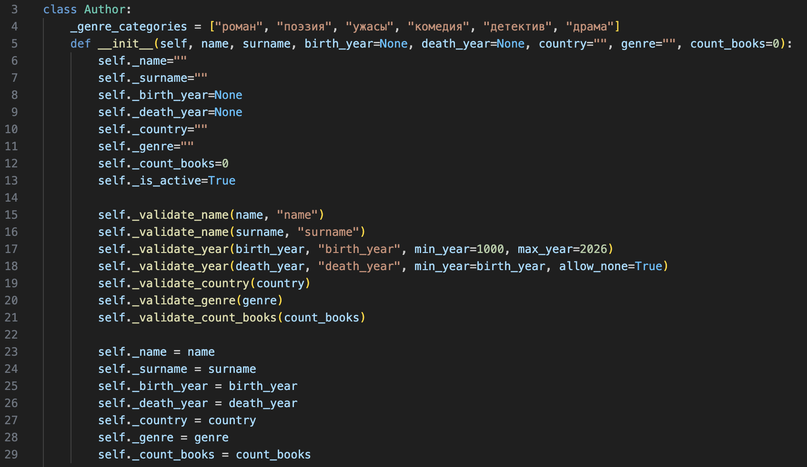
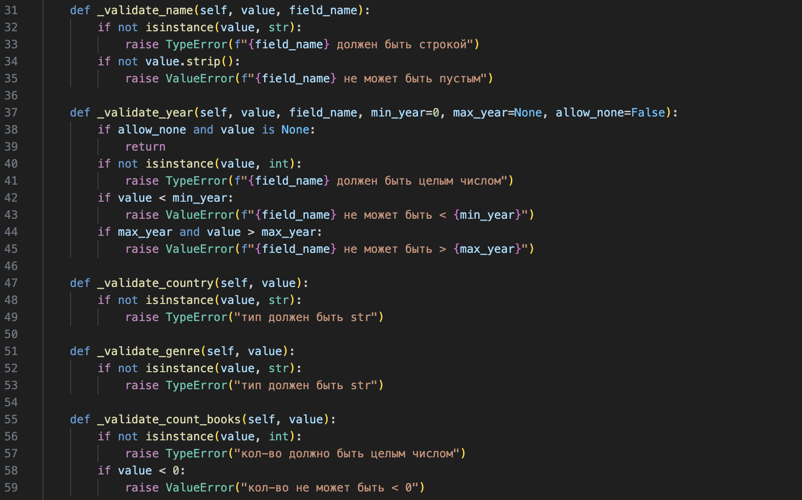

# ЛР-1 — Класс и инкапсуляция 
## Предметная область - Библиотека/Книги (Вариант 2); реализованный класс - Author
# файл model.py
## инициализация, инкапсуляция(закрытые поля), атрибут класса(genre), валидация через методы

## методы валидации

## свойства (@property)

## свойства с сеттерами

## методы для изменения логического состояния

## бизнес методы

## доступ к атрибуту класса (@classmethod)

## магические методы (__str__, __repr__, __eq__)

# файл demo.py
#### создание объектов
#### информация об авторах
#### магические методы, бизнес методы, методы валидации, методы для изменения логического состояния
#### сеттеры, свойства @property
#### доступ к атрибуту класса

