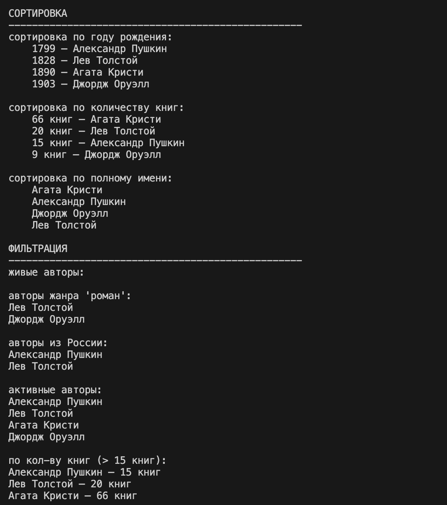

# Лабораторная работа №2 — Коллекция объектов
## Вариант 2 - Книги/Библиотека
### Цели работы
* Научиться работать с **коллекциями объектов**.
* Понять разницу между **моделью сущности и контейнером объектов**.
* Реализовать **собственный контейнерный класс**.
* Освоить **итерацию по объектам**.
* Реализовать базовые операции управления коллекцией.

## Описание реализованного класса
### Класс `AuthorCollection`
Класс-контейнер для хранения и управления объектами `Author`

**Методы управления коллекцией:**
- `add(author)` — добавление автора 
- `remove(author)` — удаление автора
- `get_all()` — возврат списка всех авторов
- `remove_at(author)` — удаление автора по индексу

**Методы поиска:**
- `find_by_full_name(author)` — поиск по полному имени автора
- `find_by_surname(author)` — поиск по фамилии автора 
- `find_by_genre(author)` — поиск по жанру книг автора 
- `find_by_country(author)` — поиск по стране рождения автора 
- `find_active(author)` — поиск по статусу активности автора 

**Магические методы:**
- `__len__()` — возвращает количество книг в коллекции
- `__iter__()` — позволяет итерироваться по коллекции в цикле `for`
- `__str__()` — строковое представление библиотеки
- `__getitem__()` — позволяет обращаться к элементам по индексу

**Методы сортировки:**
- `sort_by_full_name` — сортировка по имени
- `sort_by_birth_year` — сортировка по году рождения
- `sort_by_count_books` — сортировка по кол-ву книг
- `sort_by_country` — сортировка по стране рождения

**Логические операции над коллекциями(фильтрация):**
- `get_alive` - возвращает новую коллекцию только живых авторов
- `get_by_genre` - возвращает новую коллекцию авторов, которые писали в определенном жанре
- `get_by_country` - возвращает новую коллекцию авторов, которые родились в определенной стране
- `get_active` - возвращает новую коллекцию авторов, которые имеют статус "активен"

# Демонстрация работы
## Сценарий 1
- Создание экземпляров класса
- Создание коллекции AuthorCollection
- Добавление объектов в коллекцию
- Проверка на дубликаты
- Проверка на тип объекта
- Итерация по коллекции

## Сценарий 2
- Поиск по атрибутам: по фамилии, по жанру, по стране, по активности авторов, по полному имени

## Сценарий 3
- Сортировка
- Фильтрация

## Сценарий 4
- проверка __len__, __repr__
- итоговое состояние коллекции

В ходе выполнения лабораторной работы были изучены и закреплены следующие темы:

- **Коллекции объектов** — создание контейнерного класса для хранения группы объектов
- **Инкапсуляция** — использование закрытого поля `_items` для хранения коллекции
- **Итерация** — реализация `__iter__()` для перебора объектов в цикле `for`
- **Магические методы** — применение `__len__()` и `__str__()` для удобной работы с коллекцией
- **Поиск и фильтрация** — реализация методов поиска по атрибутам объектов
- **Валидация** — проверка типа добавляемых объектов и защита от дубликатов

