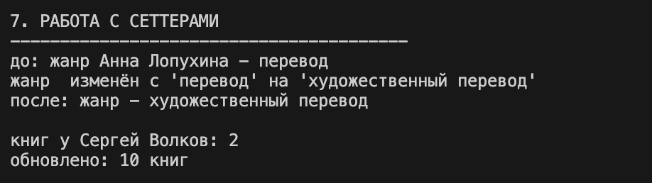
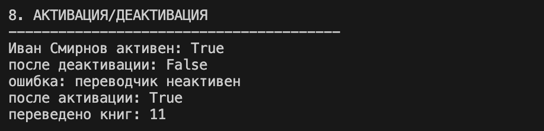
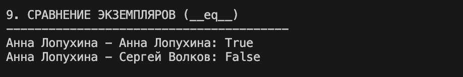
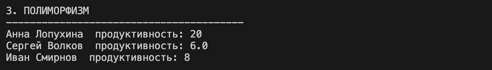

# Лабораторная работа №3 — Наследование и иерархия классов
## Вариант 2 — Книги/Библиотека 

## Цель работы

* Освоить механизм **наследования классов**.
* Научиться строить **иерархию объектов**.
* Понять разницу между:
  * базовым классом
  * производным классом
* Научиться **переиспользовать код**.
* Освоить **переопределение методов**.

## Описание реализованной иерархии

### Базовый класс `Author` (из ЛР-1/ЛР-2)
Класс, представляющий автора книг.

**Атрибуты:**
- `name`, `surname` — имя и фамилия
- `birth_year`, `death_year` — годы жизни
- `country` — страна
- `genre` — жанр книг
- `count_books` — количество написанных книг
- `is_active` — статус активности

**Основные методы:**
- `get_full_name()`, `get_initials()` — получение полного имени/инициалов
- `is_alive()` — проверка, жив ли автор
- `add_book()` — добавление книг
- `get_info()` — получение полной информации
- `activate()` / `deactivate()` — управление статусом
- `__str__()`, `__repr__()`, `__eq__()` — магические методы

### Дочерний класс `Translator` (Переводчик)
идет наследование от класса `Author`. Представляет автора, который также занимается переводами

**Добавленные атрибуты:**
- `languages_from` — языки, с которых переводит
- `languages_to` — языки, на которые переводит
- `translated_books` — количество переведённых книг

**Новые методы:**
- `add_translation()` — добавление переводов
- `get_language_pair()` — получение языковой пары (с -> на)
- `translation_efficiency()` — эффективность перевода (переведено/написано)

**Переопределённые методы:**
- `get_info()` — дополняет информацию о переводчике
- `__str__()` — строковое представление с данными о переводах
- `calculate()` — возвращает количество переведённых книг (полиморфный метод)

---

### Дочерний класс `Biographer` (Биограф)
идет наследование от класса `Author`. Представляет автора, который пишет биографию других писателей

**Добавленные атрибуты:**
- `subjects` — объекты исследования (о ком пишет)
- `biographies_count` — количество написанных биографий
- `has_interviews` — использует ли интервью

**Новые методы:**
- `add_biography()` — добавление биографии (переиспользует `add_book()`)
- `get_main_subject()` — получение главного объекта исследования
- `is_research_based()` — описание метода работы

**Переопределённые методы:**
- `get_info()` — дополняет информацию о биографе
- `__str__()` — строковое представление с данными о биографиях
- `calculate()` — продуктивность (биографии × 1.5, если есть интервью)

## Полиморфизм. полиморфное поведение

Все классы реализуют общий интерфейс через бизнес-метод `calculate()`:

Класс - метод `calculate()` - что возвращает 
--------------------------------------------
- `Author` - не переопределён — AttributeError
- `Translator` - переопределен - translated_books
- `Biographer` - переопределен - biographies_count × 1.5 (если есть интервью) 

## Интеграция с коллекцией (ЛР-2)

Класс `AuthorCollection` из ЛР-2 успешно работает с объектами **любых наследников** `Author`:
- `Translator`
- `Biographer`

Из-за использования `isinstance(author, Author)` коллекция принимает все дочерние классы

# Демонстрация работы

## Сценарий 1 — Создание объектов, коллекция авторов

Создание экземпляров `Translator` и `Biographer` с использованием `super()`. Добавление объектов разных типов в `AuthorCollection`

## Сценарий 2 — Фильтрация по типу (isinstance)

Получение списков переводчиков/биографов из коллекции атворов

## Сценарий 3 — Методы дочерних классов

- get_language_pair() и translation_efficiency() у Translator
- get_main_subject() и is_research_based() у Biographer

## Сценарий 4 — Переопределённые методы

`get_info()` и `__str__()`

## Сценарий 5 — Работа с сеттерами и статусом

Изменение атрибутов через сеттеры, активация/деактивация объектов

## Сценарий 6 — Сравнение объектов (__eq__)

Сравнение экземпляров по фамилиям

## Сценарий 7 — Классовые методы (работа с жанрами)

Добавление новых жанров через классовый метод add_genre()

## Сценарий 8 — Полиморфное поведение

# Выводы

В ходе выполнения лабораторной работы были изучены и закреплены следующие темы:
- **Наследование**  дочерние классы: Translator(Author) и Biographer(Author)
- **Переиспользование кода**  `super().__init__()` без дублирования атрибутов 
- **Переопределение методов**  get_info(), __str__(), calculate() 
- **Полиморфизм**  Единый вызов calculate() для разных типов 
- **Интеграция с коллекцией**  AuthorCollection хранит любых наследников `Author` 
- **Инкапсуляция**  Приватные атрибуты (_name, _count_books и др.) 

