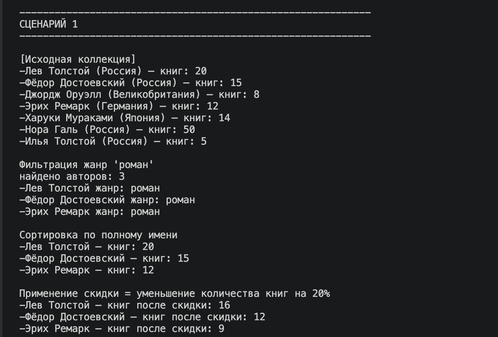
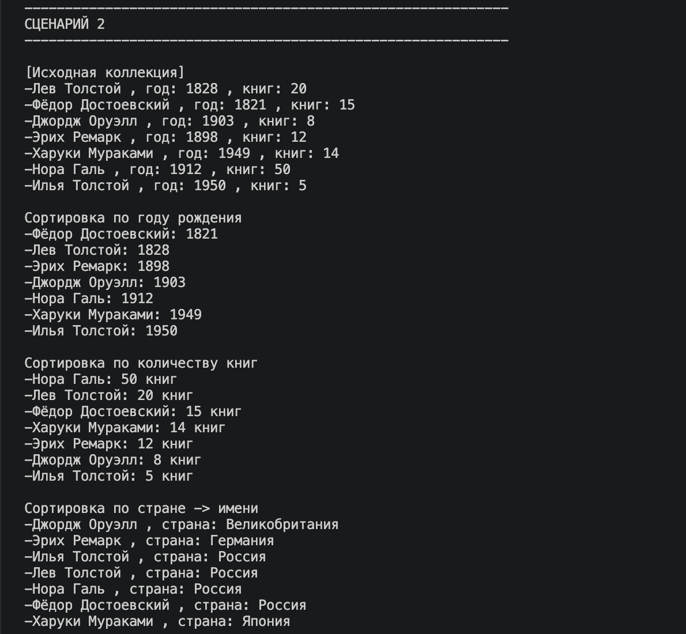
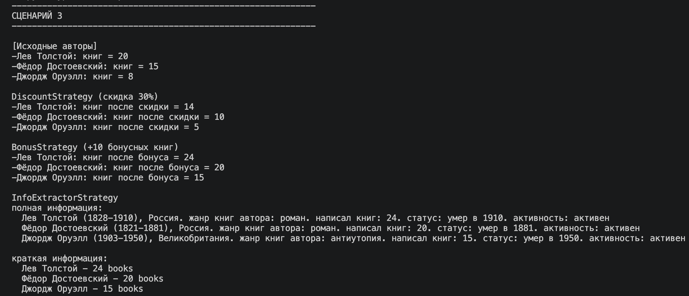
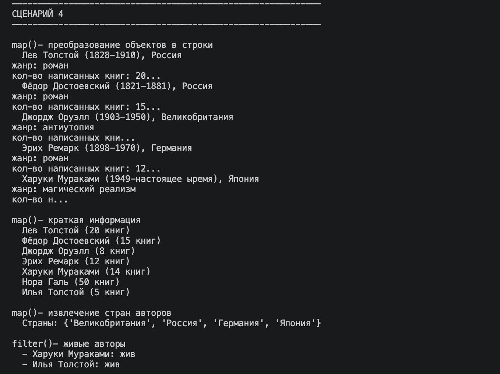
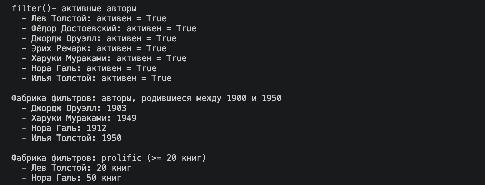
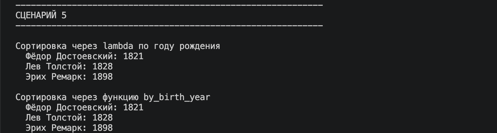

# Лабораторная работа №5 — Функции как аргументы. Стратегии и делегаты.

## Цель работы

- Освоить передачу функций как аргументов в другие функции и методы
- Научиться применять встроенные функции высшего порядка: `map`, `filter`, `sorted`
- Понять концепцию паттерна «Стратегия» и реализовать его на Python
- Освоить `lambda`-выражения и их практическое применение
- Интегрировать функциональный стиль с объектно-ориентированным кодом из предыдущих ЛР

## Реализованные функции и стратегии

### Стратегии сортировки 

 - `by_full_name` - сортировка по полному имени (фамилия + имя) 
 - `by_birth_year` - сортировка по году рождения 
 - `by_count_books` - сортировка по количеству написанных книг 
 - `by_country_then_name` - сортировка по стране, затем по имени 
 - `by_translated_books` - сортировка по количеству переведённых книг (для переводчиков) 
 - `by_biographies_count` - сортировка по количеству написанных биографий (для биографов) 

### Функции-фильтры 

 - `is_active` - фильтр активных авторов 
 - `is_alive` - фильтр живых авторов 
 - `is_translator` - фильтр только переводчиков 
 - `is_biographer` - фильтр только биографов 

### Фабрики функций

 - `is_by_genre(genre)` - создаёт фильтр по жанру 
 - `is_prolific(min_books)` - создаёт фильтр по минимальному количеству книг 
 - `make_year_filter(min_year, max_year)` - создаёт фильтр по диапазону годов рождения 
 - `make_price_filter(max_price)` - создаёт фильтр по максимальной цене  

### Функции для map

 - `to_string_representation` - преобразование объекта в строку 
 - `to_short_info` - краткая информация об авторе 
 - `extract_country` - извлечение страны автора 
 - `apply_discount(discount_rate)` - фабрика для применения скидки к количеству книг 

### Паттерн «Стратегия» (callable-объекты)

 - `DiscountStrategy` - применение скидки к количеству книг автора 
 - `BonusStrategy` - начисление бонусных книг автору 
 - `ActivatorStrategy` - активация автора 
 - `InfoExtractorStrategy` - извлечение информации в разных форматах (full/short/name) 

### Методы коллекции (расширение AuthorCollection)

- `sort_by(key_func, reverse=False)` - сортировка коллекции по переданной стратегии 
- `filter_by(predicate)` - фильтрация коллекции по предикату 
- `apply(func)` - применение функции ко всем элементам коллекции 
- `map(func)` - преобразование коллекции с помощью map() 

## Демонстрация работы

### Сценарий 1 — Полная цепочка filter -> sort -> apply

1. **Фильтрация** — только авторы с жанром "роман"
2. **Сортировка** — по полному имени автора
3. **Применение стратегии** — скидка 20% на количество книг

### Сценарий 2 — Замена стратегии сортировки

одна и та же коллекция сортируется тремя разными стратегиями без изменения кода коллекции:
- сортировка по году рождения
- сортировка по количеству книг (по убыванию)
- сортировка по стране -> имени

### Сценарий 3 — Callable-объекты как стратегии

Применение стратегий, реализованных в виде классов с методом `__call__`:
- `DiscountStrategy` — уменьшение количества книг на 30%
- `BonusStrategy` — + 10 бонусных книг
- `InfoExtractorStrategy` — извлечение информации в разных форматах

### Сценарий 4 — map(), filter(), фабрики функций

применение:
- `map()` для преобразования объектов в строки, краткую информацию и получения стран
- `filter()` для отбора живых/активных авторов, переводчиков/биографов
- Фабрика функций для создания фильтров по году рождения и продуктивности

### Сценарий 5 - Сравнение lambda и именованной функции

lambda-выражения и именованные функции дают идентичный результат при сортировке:
- сортировка по году рождения через lambda и через `by_birth_year`
- сортировка по количеству книг через lambda и через `by_count_books`

## Выводы

В ходе выполнения лабораторной работы были изучены и закреплены следующие темы:
Передача функций как аргументов: функции могут быть параметрами других функций. Это позволяет создавать гибкие и переиспользуемые алгоритмы. lambda-выражения: 
удобный способ создания анонимных функций для простых операций, особенно в сочетании с `map()`, `filter()` и `sorted()`.
Функции высшего порядка: `map()` — применение функции к каждому элементу коллекции, `filter()` — фильтрация элементов по условию, `sorted()` — сортировка с пользовательским ключом. 
Паттерн «Стратегия»: поведенческий паттерн, позволяющий выбирать алгоритм во время выполнения. ъ
